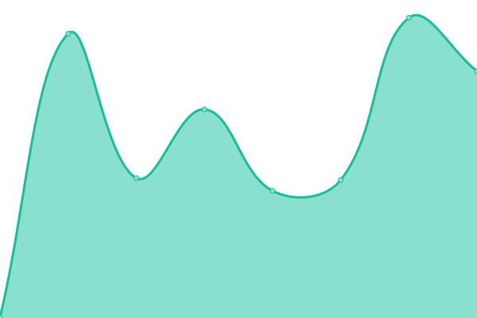
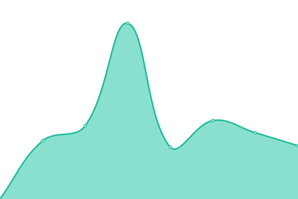
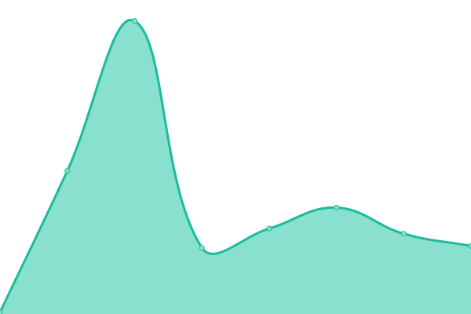
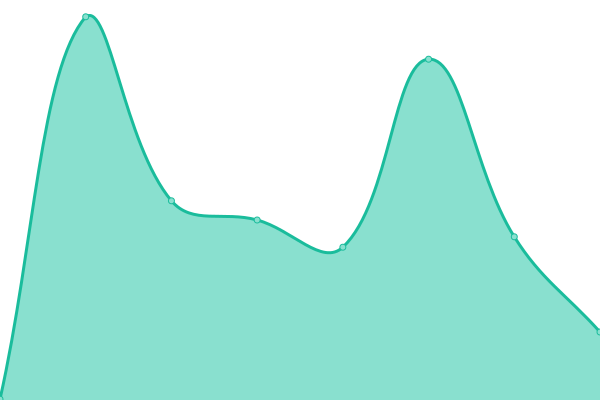

# [📈 Estado en directo](https://monitor.awake.travel): <!--live status--> **🟧 Partial outage**

This repository contains the open-source uptime monitor and status page for [John Fredy Velasco Bareño.](https://monitor.awake.travel), powered by [Upptime](https://github.com/upptime/upptime).

With [Upptime](https://upptime.js.org), you can get your own unlimited and free uptime monitor and status page, powered entirely by a GitHub repository. We use [Issues](https://github.com/jovel882/awake/issues) as incident reports, [Actions](https://github.com/jovel882/awake/actions) as uptime monitors, and [Pages](https://monitor.awake.travel) for the status page.

## [📈 Live Status](https://demo.upptime.js.org): <!--live status--> **🟧 Partial outage**

<!--start: status pages-->
<!-- This summary is generated by Upptime (https://github.com/upptime/upptime) -->
<!-- Do not edit this manually, your changes will be overwritten -->
<!-- prettier-ignore -->
| URL | Status | History | Response Time | Uptime |
| --- | ------ | ------- | ------------- | ------ |
|  AWAKE | Arriba | [awake.yml](https://github.com/awjvelasco/awake/commits/HEAD/history/awake.yml) | 

 386ms
     
 | 

<a href="https://monitor.awake.travel/history/awake">100.00%</a>
    

|  INTEGRACIONES | Arriba | [integraciones.yml](https://github.com/awjvelasco/awake/commits/HEAD/history/integraciones.yml) | 

 4965ms
     
 | 

<a href="https://monitor.awake.travel/history/integraciones">97.19%</a>
    

|  NTDS | Arriba | [ntds.yml](https://github.com/awjvelasco/awake/commits/HEAD/history/ntds.yml) | 

 2080ms
     
 | 

<a href="https://monitor.awake.travel/history/ntds">100.00%</a>
    

|  AWAKEU | Abajo | [awakeu.yml](https://github.com/awjvelasco/awake/commits/HEAD/history/awakeu.yml) | 

 19717ms
     
 | 

<a href="https://monitor.awake.travel/history/awakeu">0.00%</a>
    

|  NAS | Arriba | [nas.yml](https://github.com/awjvelasco/awake/commits/HEAD/history/nas.yml) | 

 625ms
     
 | 

<a href="https://monitor.awake.travel/history/nas">100.00%</a>
    

|  SONAR | Abajo | [sonar.yml](https://github.com/awjvelasco/awake/commits/HEAD/history/sonar.yml) | 

 270ms
     
 | 

<a href="https://monitor.awake.travel/history/sonar">0.00%</a>
    

|  JENKINS | Arriba | [jenkins.yml](https://github.com/awjvelasco/awake/commits/HEAD/history/jenkins.yml) | 

 370ms
     
 | 

<a href="https://monitor.awake.travel/history/jenkins">100.00%</a>
    

<!--end: status pages-->

[**Visit our status website →**](https://monitor.awake.travel)

## 📄 License

- Powered by: [Upptime](https://github.com/upptime/upptime)
- Code: [MIT](./LICENSE) © [John Fredy Velasco Bareño.](https://monitor.awake.travel)
- Data in the `./history` directory: [Open Database License](https://opendatacommons.org/licenses/odbl/1-0/)
